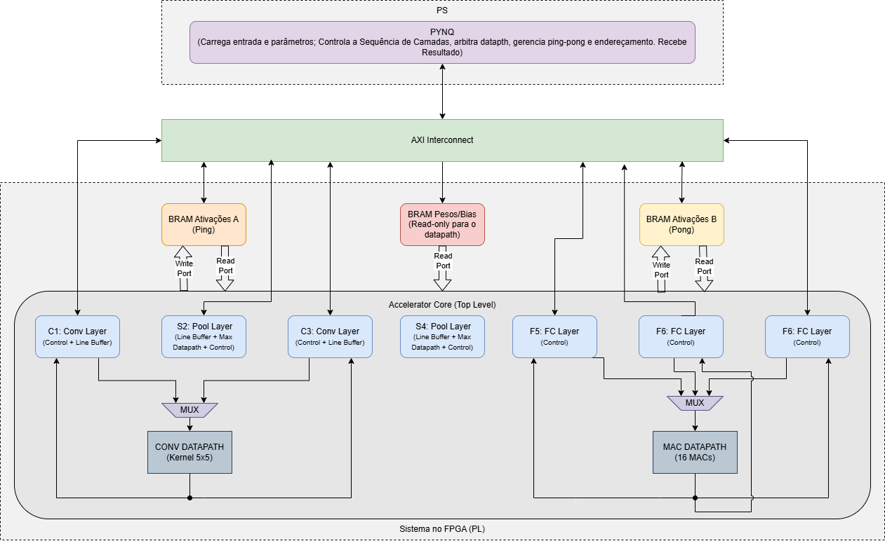

# Projeto e Implementação de um Acelerador de CNN em FPGA baseado em SoC

Este repositório contém o desenvolvimento de um acelerador de hardware dedicado à rede neural convolucional **LeNet-5**, implementado em ambiente **SoC (System-on-Chip) Zynq-7000**. O projeto é parte integrante do Trabalho de Conclusão de Curso de Engenharia da Computação na **UFES - Campus São Mateus**.

## Resumo do Projeto

O objetivo deste trabalho é mitigar o custo computacional das operações de Multiplicação e Acumulação (MAC) em Redes Neurais Convolucionais. A solução utiliza uma abordagem de **Co-design Hardware/Software**:
* **Hardware (PL):** Acelerador em VHDL focado no paralelismo das camadas convolucionais.
* **Software (PS):** Controle e gerenciamento via framework **PYNQ (Python on Zynq)**.

## Arquitetura e Fluxo de Dados

O sistema baseia-se na co-projeto hardware/software, utilizando a infraestrutura do SoC Zynq-7000 para acelerar as camadas convolucionais da LeNet-5.

*O diagrama acima ilustra a integração entre o PS (ARM) e a PL (FPGA), destacando os controladores de memória, barramentos AXI e o fluxo de dados para os aceleradores.*

O projeto abrange desde o treinamento do modelo até a implementação RTL:

1. **Treinamento:** Realizado em Python (PyTorch) para definição dos pesos ideais.
2. **Quantização:** Conversão dos parâmetros para ponto fixo (Integer/Fixed-point) para otimização de recursos na FPGA.
3. **Hardware Mapping:** Implementação de Unidades de Processamento (PEs) e hierarquia de memória baseada em BRAMs para reduzir o gargalo.

## Estrutura do Repositório

### 1. Hardware (Vivado/VHDL)
* `/Lenet5_FPGA.srcs`: Ficheiros fonte VHDL (Top module, Datapaths, Controladores).
* `Lenet5_FPGA.xpr`: Ficheiro de projeto do Vivado.
* `rebuild_bd.tcl`: Script para reconstrução automática do Block Design.

### 2. Software & Parâmetros
* `lenet5.ipynb`: Notebook para treinamento da rede e extração inicial de pesos.
* `lenet_quant.ipynb`: Script de quantização e formatação dos parâmetros para o hardware.
* `/notebooks`: Interface Jupyter para execução do *overlay* na placa Zynq com ficheiros de texto contendo os pesos e bias prontos para carga (ex: `conv1_params`, `fc1_params`).

## Especificações Técnicas (Target: Zynq XC7Z010)

* **Clock de Operação:** 100 MHz.
* **Interface de Comunicação:** AXI4-Lite (Controle) e BRAM/AXI-Stream (Dados).
* **Paralelismo:** Processamento paralelo de janelas de convolução 5x5.
* **Funcionalidades:** Suporte a Convolução, Max-Pooling, ReLU e Fully Connected layers.

## Autoria e Orientação

* **Autor:** Norian Silva Aredes Hermsdorf
* **Instituição:** Universidade Federal do Espírito Santo (UFES) - CEUNES.

---
*Este projeto está em desenvolvimento como parte dos requisitos para o TCC (2026).*
